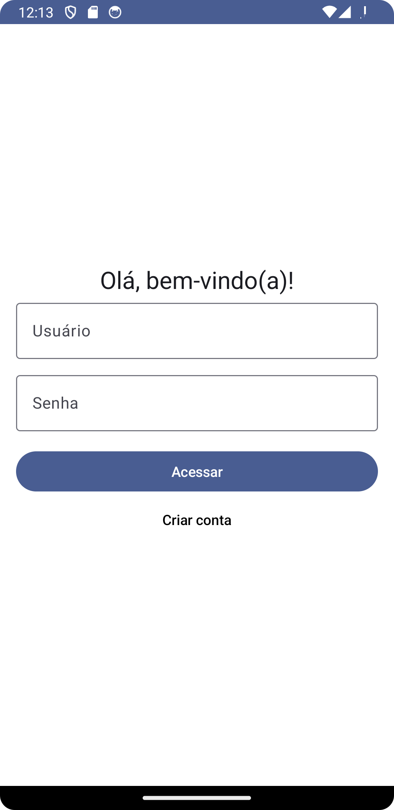
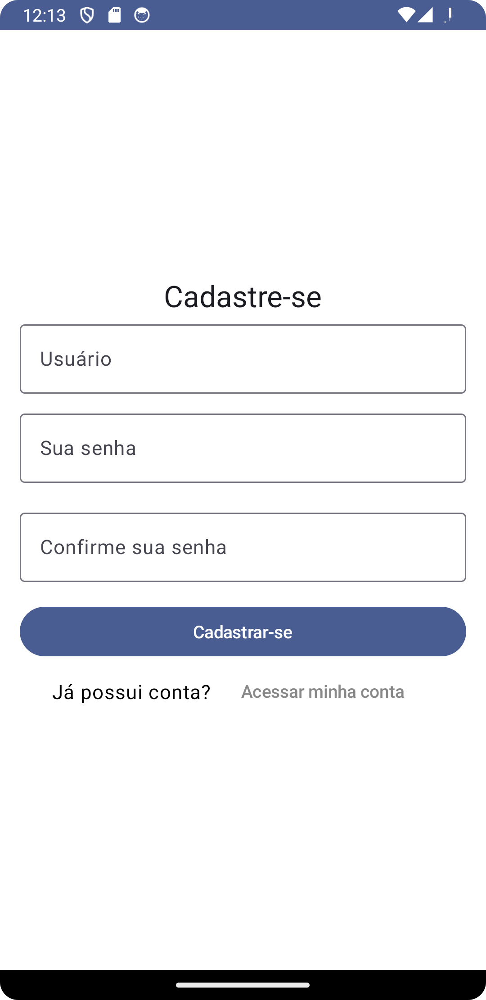
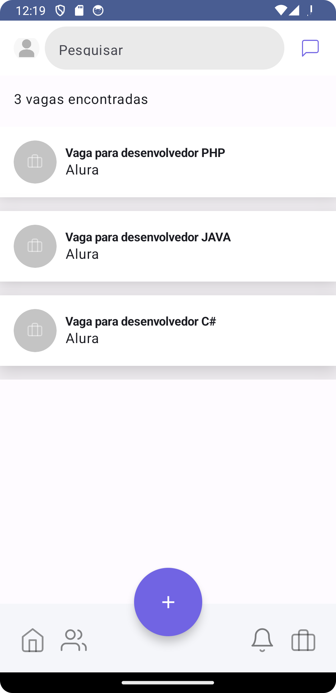

# Cap 1 - O mundo das pequenas telas - Desenvolvendo um APP
Aplicação desenvolvida para avaliação acadêmica pela FIAP, aplicação contempla MVP de uma aplicação HRTech Mobile construída em Kotlin.
### A primeira versão contempla:
- Tela de login
- Tela de cadastro
- Listagem de vagas

* Todas as telas consomem da API entregue no semestre anterior: [LucasCCS/fiap_webservice_restfull_rm96639
](https://github.com/LucasCCS/fiap_webservice_restfull_rm96639)

## Preview (Imagens e Gifs)

